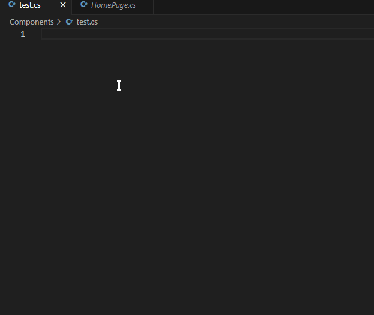

# MauiReactor Snippets

This is a VSCode extension based on snippets.  
It helps you quickly generate MauiReactor components, states, parameters, and properties.

## Included Snippets

- `mrcp` → Component template  

- `mrcps` → Component + State class  

- `mrparam` → `[Param] IParameter<Custom>` template  

- `mrprop` → `[Prop]` property template  

- `mrinject` → `[Inject]` property template  

- `mrnode` → VisualNode Function

## Usage

Simply type the snippet keyword in a `.cs` file, and the code will be auto-generated.
---
# MauiReactor Snippets

스니펫 기반의 VSCode 확장입니다.  
MauiReactor 컴포넌트, 스테이트, 파라미터, 프로퍼티 등을 빠르게 생성할 수 있어요.

## 포함된 스니펫 목록

- `mrcp` → Component 기본 템플릿

- `mrcps` → Component + State 클래스

- `mrparam` → [Param] IParameter<Custom> 템플릿

- `mrprop` → [Prop] 속성 템플릿

- `mrinject` → [Inject] 속성 템플릿

- `mrnode` → VisualNode 함수

## 사용법

`.cs` 파일에서 위 키워드를 입력하면 자동으로 코드가 생성됩니다.